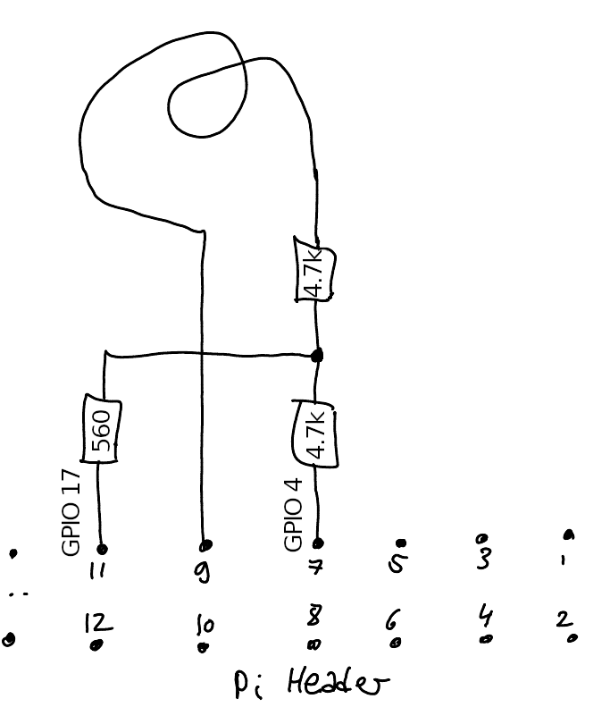
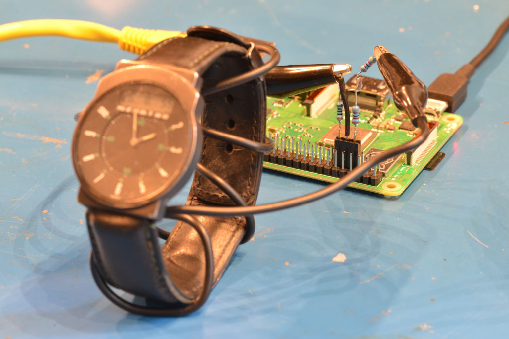

DCF77 transmitter using the Raspberry Pi
=========================================

### Setting a DCF77 clock
I am living in a country where there is no [DCF77] sender nearby for my
European radio controlled wristwatch to get its time.
So I built my own 'transmitter'.

The DCF77 signal is a 77.5kHz carrier, that is amplitude modulated with
attenuations every second of the minute except the 59th to synchronize.
The length of the attentuation (100ms and 200ms) denotes bit values 0 and 1
respectively so each in each minute, 59 bits can be transferred, containing
date and time information.

The Raspberry Pi has ways to create frequencies by integer division and
fractional jitter around that, which allows us to generate a frequency
of 77500.003Hz, which is close enough.

### Minimal External Hardware

The external hardware is simple: we use the frequency output on one pin and
another pin to pull the signal to a lower level for the regular attenuation.

To operate, you need three resistors: 2x4.7kΩ and one 560Ω, wired to GPIO4 and
GPIO17 like so:

Schematic                      | Real world
-------------------------------|------------------------------
   |


(GPIO4 and 17 are on the inner row of the Header pin, three pins inwards on
the [Raspberry Pi GPIO]-Header)

Now, wire a loop of wire between the open end of the one 4.7kΩ and  ground
(which is conveniently located between GPIO4 and GPIO17 and shown above with
the black heatshrink). Wrap this wire-loop roughly around the antenna of your
watch/clock:



### Transmit!

```
 make
 sudo ./dcf77sim
```

In the video below, you can see how a watch is set with this transmitter.
After it is set to zero, it waits until it sees the end-of-minute mark (which
does not have any amplitude modulation) and then starts to count on from
second 59, then gathering the data that is following.

An interesting observation: you see that the watch already gets into fully
set mode after about 50 seconds, even though there is the year data
after that. This particular watch never shows the year, so it just ignores that.

<a href="https://youtu.be/WzZnGimRj60"></a>

[DCF77]: https://en.wikipedia.org/wiki/DCF77
[Raspberry Pi GPIO]: https://www.raspberrypi.org/documentation/usage/gpio/